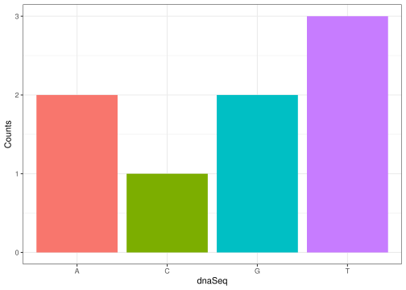

<!-- README.md is generated from README.Rmd. Please edit that file -->

## Overview

The aim of this simple R package is to replicate the central dogma of
molecular biology. The package provides a collection of functions that
help visualise and summarise nucleotide data and perform basic functions
on DNA sequences, like transcription, translation, plotting, etc.

## Installation

load the library

``` r
library(CoolMolBio)
```

## Functions

The packages has 5 different functions explained in the following:

### 1. dnaSequence()

This function generates a random DNA sequence of a specified length. It
samples nucleotides (“A”, “T”, “G”, “C”) with replacement, meaning bases
can repeat, and then concatenates them into a single string.

``` r
dnaSequence(21)
#> [1] "GAAGGTACACTCTCCTAGCCG"
```

### 2. transcription()

This function receives a DNA strand as a string and converts all T’s
into U’s, turning it into an RNA strand.

``` r
transcription("ATCGCTAG")
#> [1] "AUCGCUAG"
```

### 3. extractCodon()

This function extracts codons from a DNA coding sequence. You can
specify the starting nucleotide to shift the reading frame (default is
1). If the sequence length is not a multiple of 3, it extracts as many
full codons as possible.

Extract codons from default coding frame:

``` r
extractCodon("ATCGTC")
#> [1] "ATC" "GTC"
```

Extract codons starting from the second nucleotide:

``` r
extractCodon("TATCGTC", 2)
#> [1] "ATC" "GTC"
```

### 4. translation()

The translation function converts mRNA codons into their a peptide
sequence.

``` r
translation(c("AUG", "GUC", "AUC"))
#> [1] "MVI"
```

### 5. createHistogram()

This function generates a histogram that shows how often each nucleotide
appears in a given DNA sequence. The output is a histogram where each
bar represents one nucleotide.

``` r
createHistogram("ATGCGTTA")
```



## Use Cases and Future Extensions

- **Teaching tool**: Ideal for classroom use to demonstrate DNA sequence
  analysis concepts.
- **Quick sequence inspection**: Useful for researchers needing fast
  insights without complex bioinformatics tools.
- **Data validation**: Helps verify sequence quality before downstream
  analyses like alignment or motif detection.

## Potential Future Functions

- **`reverseComplement(dna_seq)`**: Get the reverse complement of DNA.
- **`exportResults(summary, file = "results.csv")`**: Write
  counts/histograms to CSV/PNG for downstream use.
- **`codonUsage()`**: Analyse codon frequency bias.

## Main points from Task 3 (summary)

- The package’s goal is to simplify basic DNA → RNA → protein operations
  and visualisations for learners and prototypers.
- It emphasises ease of use and interpretability: small functions, clear
  inputs/outputs, and simple visual outputs.

**Limiting dependencies:**

- Fewer dependencies make our package more stable, faster to install,
  and easier to maintain. Each extra dependency adds potential for
  version conflicts or breakages.

@importFrom **vs. `package::function()`**

- @importFrom package function imports a function so it can be used
  directly without the `::` prefix  
  It is useful for frequent use but less explicit.
- `package::function()` calls the function directly from another package
  without importing  
  It is clearer and safer for occasional use.
